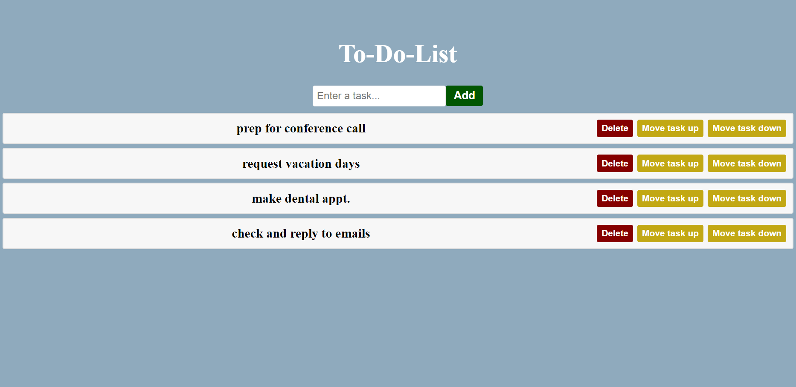

# ToDoList

A simple To-Do List application built with React.

## Getting Started

This project was bootstrapped with [Create React App](https://github.com/facebook/create-react-app).

### Available Scripts

In the project directory, you can run:

#### `npm start`

Runs the app in development mode. Open [http://localhost:3000](http://localhost:3000) to view it in your browser. The page will reload when you make changes.

#### `npm test`

Launches the test runner in the interactive watch mode. See the section about running tests for more information.

#### `npm run build`

Builds the app for production to the `build` folder. It correctly bundles React in production mode and optimizes the build for the best performance. The build is minified and the filenames include the hashes.

#### `npm run eject`

Note: this is a one-way operation. Once you eject, you can't go back!

If you aren't satisfied with the build tool and configuration choices, you can eject at any time. This command will remove the single build dependency from your project.

### Features

- Add, delete, and reorder tasks
- Responsive design

### Usage

1. Clone the repository: `git clone <repository-url>`
2. Navigate to the project directory: `cd <project-directory>`
3. Install dependencies: `npm install`
4. Run the app: `npm start`

### Learn More

To learn more about React, check out the [React documentation](https://reactjs.org/).

### Troubleshooting

If you encounter issues with the build process, you may find helpful information in the [Create React App troubleshooting guide](https://facebook.github.io/create-react-app/docs/troubleshooting).